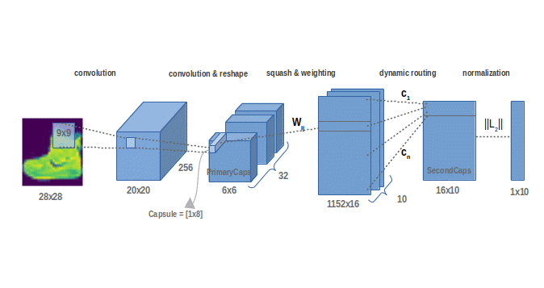

# CapsNet with PyTorch

Implementation of capsule network with [pytorch](https://pytorch.org/).

This is the architecture of a capsule network:

The network is trained on the FashionMNIST dataset:

Adapted from:

https://github.com/gram-ai/capsule-networks

https://github.com/higgsfield/Capsule-Network-Tutorial/blob/master/Capsule%20Network.ipynb
